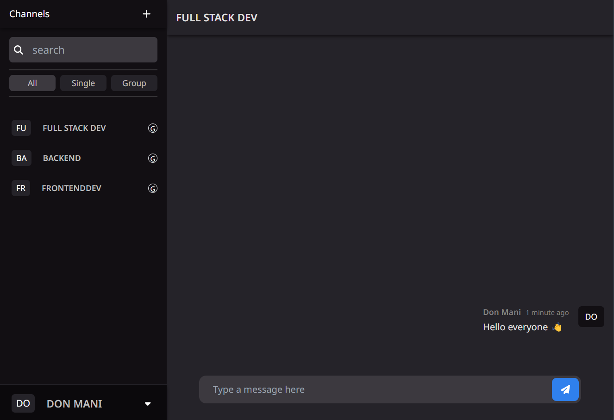

<h1 align="center">Chat Group</h1>

<div align="center">
   Solution for a challenge from  <a href="http://devchallenges.io" target="_blank">Devchallenges.io</a>.
</div>

<div align="center">
  <h3>
    <a href="https://chatv2-6nka.onrender.com" target="_blank">
      Demo
    </a>
    <span> | </span>
    <a href="" target="_blank">
      Solution
    </a>
    <span> | </span>
    <a href="https://legacy.devchallenges.io/challenges/UgCqszKR7Q7oqb4kRfI0" target="_blank">
      Challenge
    </a>
  </h3>
</div>

<!-- TABLE OF CONTENTS -->

## Table of Contents

-   [Overview](#overview)
-   [Installation](#installation)
-   [Built With](#built-with)
-   [Features](#features)
-   [Acknowledgements](#acknowledgements)

<!-- OVERVIEW -->

## Overview



#### Installation:

1.  Clone the repository:

    ```bash
    git clone https://github.com/render217/chatv2
    ```

2.  Create a .env file in backend/config folder and add the following as key = value

          ```
        MONGODB_URI=
        DB_NAME=
        JWT_SECRET=
        JWT_EXPIRES_IN=
        PORT=
        NODE_ENV=
        CORS_ORIGIN=
          ```

    Create a .env file in frontend directory and add the following as key = value

    ```
      VITE_SOCKET_URI=http://localhost:<PORT>
      VITE_BACKEND_URI=http://localhost:<PORT>/api

      N.B(PORT => port you used for the backend)
    ```

3.  Navigate into the directory and install dependencies: both in frontend and backend folder

    ```bash
    npm install
    ```

4.  Start the development server: in both client and backend folder
    ```bash
    npm run dev
    ```

### Built With

<!-- This section should list any major frameworks that you built your project using. Here are a few examples.-->

-   **React**
-   **Tailwind**
-   **Express**
-   **Socket.io**
-   **MongoDB**

## Features

<!-- List the features of your application or follow the template. Don't share the figma file here :) -->

This application/site was created as a submission to a [DevChallenges](https://legacy.devchallenges.io/challenges/UgCqszKR7Q7oqb4kRfI0) challenge. The [challenge](https://legacy.devchallenges.io/challenges/UgCqszKR7Q7oqb4kRfI0) was to build an application to complete the given user stories.

-   User story: By default, I am in the Welcome channel
-   User story: I can create a new channel with a name and a description
-   User story: I can select a channel of my choice
-   User story: When I can select a channel, I am added as a member of the channel
-   User story: I can see a member of the channel
-   User story: I can send a message
-   User story: I can see other people's messages
-   User story(optional): I can search for a group

## Acknowledgements

-   [Render](https://render.com) - For Both Frontend and backend deployment
